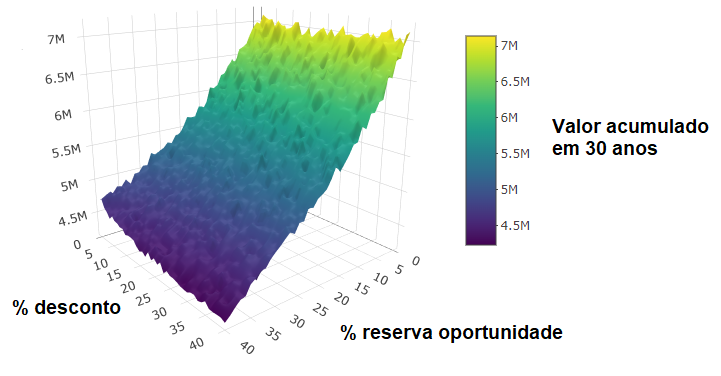

# reserve-opportunity-investment-simulation
Investment strategy simulation testing the impact of maintaining a cash reserve ("reserve opportunity") on long-term S&amp;P 500 portfolio growth (1950–2023) with Monte Carlo analysis.

# Reserve Opportunity Investment Simulation

This project investigates the practical benefit of holding a **reserve opportunity** cash buffer while investing monthly in the S&P 500 index over a 30-year horizon. 

The reserve opportunity strategy allocates part of the monthly investment as cash, to be used opportunistically when the market price drops below a defined discount threshold relative to the average purchase price.

---

## Project Overview

- Historical monthly S&P 500 data from 1950 to 2023 was used.
- Simulations randomly select a starting month between 1950 and 1992, ensuring a full 30-year investment period.
- A fixed monthly investment of $5,000 is made.
- The reserve opportunity percentage is varied from 0% to 40%.
- The discount threshold (trigger to spend the reserve) varies from 0% to 40%.
- For each parameter pair, 1000 Monte Carlo simulations are run.
- The goal: evaluate if maintaining a cash reserve to buy shares at a discount improves total accumulated value compared to fully investing monthly.

---

## Methodology

The simulation logic is implemented in R and follows these steps:

1. Each month, receive $5,000 income.
2. Invest monthly according to the reserve opportunity strategy:
   - Invest (1 - reserve_percentage) of the total portfolio value in shares.
   - Keep reserve_percentage in cash.
3. If the current price falls below the average purchase price by at least the discount threshold, deploy the entire cash reserve to buy shares at the discounted price.
4. Repeat for 360 months (30 years).

---

## Results

- The average final portfolio value is recorded for each combination of reserve and discount threshold.
- Initial results indicate that holding a reserve opportunity does **not** improve final portfolio value in this historical context.
- Visualizations are provided in the `results/plots` directory.

### Example plots

- 3D surface plot of final portfolio value as a function of reserve percentage and discount threshold:

---

## How to run

1. Load the historical data (`data/sp500_mensal.csv`).
2. Run the script `R/investment_simulation.R`.
3. Results will be saved in `results/valores_medios_acum_v2.RDS`.
4. Use the included plotting code or modify as needed.

---

## Questions & Next Steps

- Would combining multiple indices (e.g., NASDAQ + S&P 500) and balancing between them yield better results?
- Is keeping cash on hand to exploit dips inherently disadvantageous compared to fully investing monthly?
- Suggestions for improving the model or adding new scenarios are welcome.

---

## License

MIT License

---

## Contact

Roberto Horn  
[robertomhorn@gmail.com]  

